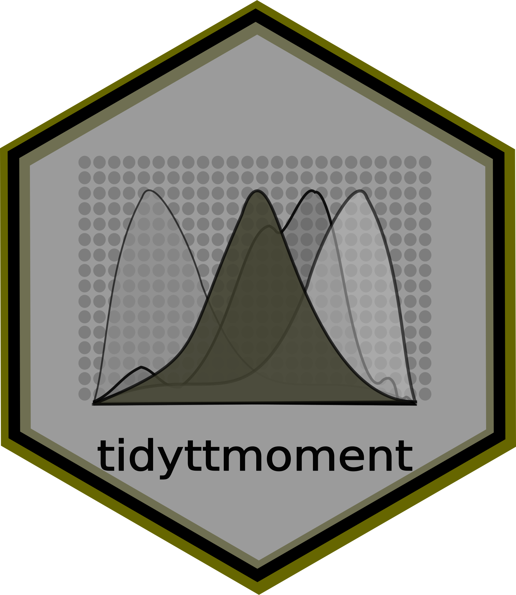

<!-- README.md is generated from README.Rmd. Please edit that file -->

# tidyttmoment <a href='https://github.com/PaulESantos/tidyttmoment'></a>

<!-- badges: start -->

[](https://lifecycle.r-lib.org/articles/stages.html#stable)
[](https://CRAN.R-project.org/package=tidyttmoment)
[](https://app.codecov.io/gh/PaulESantos/tidyttmoment?branch=main)
[](https://github.com/PaulESantos/tidyttmoment/actions/workflows/R-CMD-check.yaml)
<!-- badges: end -->

Functional traits are key characteristics of organisms that relate to
their performance, ecology, and evolution. The distribution of
functional traits can provide important insights into the functioning of
ecosystems and the responses of organisms to environmental change.
Evaluating the moments of this distribution (i.e., mean, variance,
skewness, and kurtosis) is a standard approach to quantifying the shape
and dispersion of the distribution. It has been widely used in
ecological and evolutionary research. However, calculating these moments
for functional traits in R currently has two objects which could be
confusing for beginners users of R. By developing the tidyttmoment R
library that allows for easy and efficient calculation of these moments,
researchers can save time and reduce the potential for errors in their
analyses.

## Key Features

- **Accurate Calculations**: Precisely computes Community-Weighted Mean
  (CWM), Variance (CWV), Skewness (CWS), and Excess Kurtosis (CWK)
  following robust methodologies established in trait scaling literature
  (*Wieczynski et al. 2019*, *Enquist et al. 2015*, *Šímová et
  al. 2018*, *Metcalfe et al. 2020*).
- **Robust `NA` Handling**: Statistically accurate scaling that properly
  omits missing trait records from both numerators and denominators.
- **Tidyverse-ready**: Fully designed around `dplyr` principles
  supporting unquoted column names (tidy evaluation).
- **Semantic Feedback**: Implements user-friendly error messaging using
  standard `cli` formatting.

## Installation

You can install the development version from
[GitHub](https://github.com/) with:

``` r
pak::pak("PaulESantos/tidyttmoment")
```

## Example

This is a realistic example demonstrating how to calculate functional
moments for an ecological dataset containing multiple traits,
communities, and species abundances:

``` r
library(tidyttmoment)
#> ── Attaching tidyttmoment package ──────────────────────── tidyttmoment 0.0.5 ──
#> ✔ fundiversity 1.1.1     ✔ funrar       1.5.0
library(dplyr)
#> 
#> Adjuntando el paquete: 'dplyr'
#> The following objects are masked from 'package:stats':
#> 
#>     filter, lag
#> The following objects are masked from 'package:base':
#> 
#>     intersect, setdiff, setequal, union
set.seed(42)

# 1. Simulate a trait database (e.g., Specific Leaf Area and Wood Density for 10 species)
species_traits <- expand.grid(
  species = paste0("sp_", 1:10),
  trait = c("SLA", "Wood_Density"),
  stringsAsFactors = FALSE
) |> 
  mutate(trait_value = runif(n(), min = 5, max = 100))

# 2. Simulate a community survey (abundances across 3 different sites)
community_survey <- expand.grid(
  comm = c("Forest_A", "Forest_B", "Grassland_C"),
  species = paste0("sp_", 1:10),
  stringsAsFactors = FALSE
) |> 
  mutate(abundance = rpois(n(), lambda = 25)) |> 
  sample_frac(0.8) # Introduce missing species realistically

# 3. Join the traits with the community abundances
ecological_data <- inner_join(community_survey, species_traits, 
                              by = "species", relationship = "many-to-many")

# 4. Calculate the 4 community-weighted moments simultaneously
trait_moments <- tidy_calc_moment(
  df = ecological_data, 
  trait_names = trait,
  comm_names = comm,
  trait_value = trait_value,
  weight = abundance
)

print(trait_moments)
#> # A tibble: 6 × 6
#>   trait        comm          cwm   cwv      cws    cwk
#>   <chr>        <chr>       <dbl> <dbl>    <dbl>  <dbl>
#> 1 SLA          Forest_A     68.6  626. -0.922   -0.475
#> 2 SLA          Forest_B     71.2  406. -0.663   -0.595
#> 3 SLA          Grassland_C  67.0  563. -0.825   -0.384
#> 4 Wood_Density Forest_A     60.1  676.  0.00362 -1.05 
#> 5 Wood_Density Forest_B     70.1  530. -0.138   -1.43 
#> 6 Wood_Density Grassland_C  56.1  586.  0.114   -0.887
```

### Advanced Tidy Functional Indices

`tidyttmoment` now provides tidy wrappers for the `fundiversity` and
`funrar` packages, allowing you to compute advanced functional indices
directly from your tidy long-format data.

**1. Functional Diversity Indices**

Calculate FDis, FRic, FEve, FDiv, and Rao’s Q:

``` r
# Calculate FDis and Rao's Q for the SLA trait
fd_indices <- tidy_calc_diversity(
  df = ecological_data |> filter(trait == "SLA"),
  comm_names = comm,
  sp_names = species,
  trait_names = trait,
  trait_value = trait_value,
  weight = abundance,
  index = c("FDis", "RaoQ")
)

print(fd_indices)
#> # A tibble: 3 × 3
#>   comm         FDis     Q
#>   <chr>       <dbl> <dbl>
#> 1 Forest_A     19.8  26.6
#> 2 Forest_B     16.3  22.2
#> 3 Grassland_C  18.4  25.8
```

**2. Functional Rarity Indices**

Calculate Functional Distinctiveness and Uniqueness:

``` r
# Computes distinctiveness (by community) and uniqueness (by species)
rarity_indices <- tidy_calc_rarity(
  df = ecological_data |> filter(trait == "SLA"),
  comm_names = comm,
  sp_names = species,
  trait_names = trait,
  trait_value = trait_value,
  weight = abundance
)

# Community-level distinctiveness (first 5 rows)
print(head(rarity_indices$distinctiveness, 5))
#> # A tibble: 5 × 3
#>   comm     species distinctiveness
#>   <chr>    <chr>             <dbl>
#> 1 Forest_A sp_1              1.13 
#> 2 Forest_A sp_10             0.876
#> 3 Forest_A sp_2              1.20 
#> 4 Forest_A sp_3              1.82 
#> 5 Forest_A sp_4              0.929

# Species-level uniqueness (first 5 rows)
print(head(rarity_indices$uniqueness, 5))
#> # A tibble: 5 × 2
#>   species uniqueness
#>   <chr>        <dbl>
#> 1 sp_1        0.0856
#> 2 sp_10       0.121 
#> 3 sp_2        0.0856
#> 4 sp_3        0.582 
#> 5 sp_4        0.324
```
